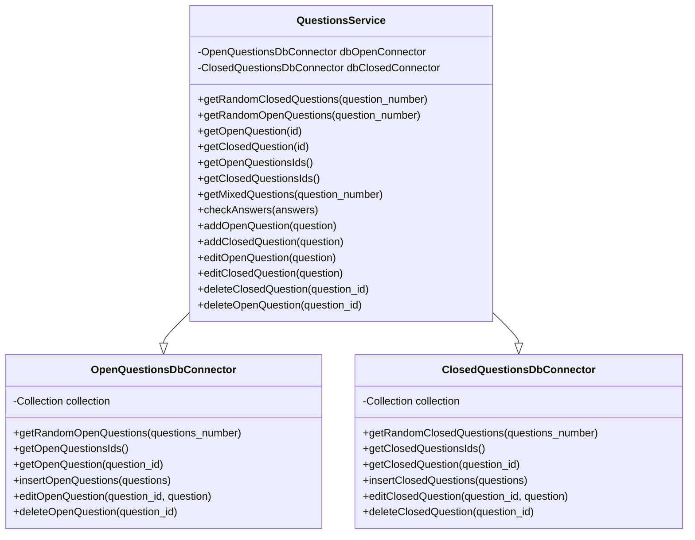
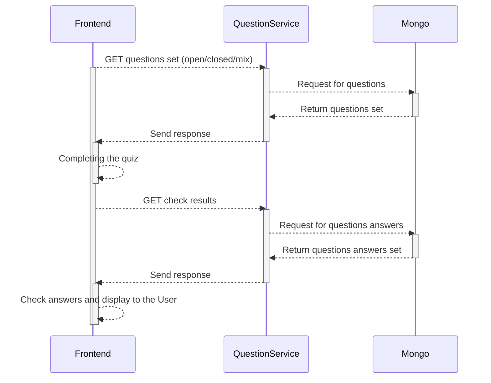
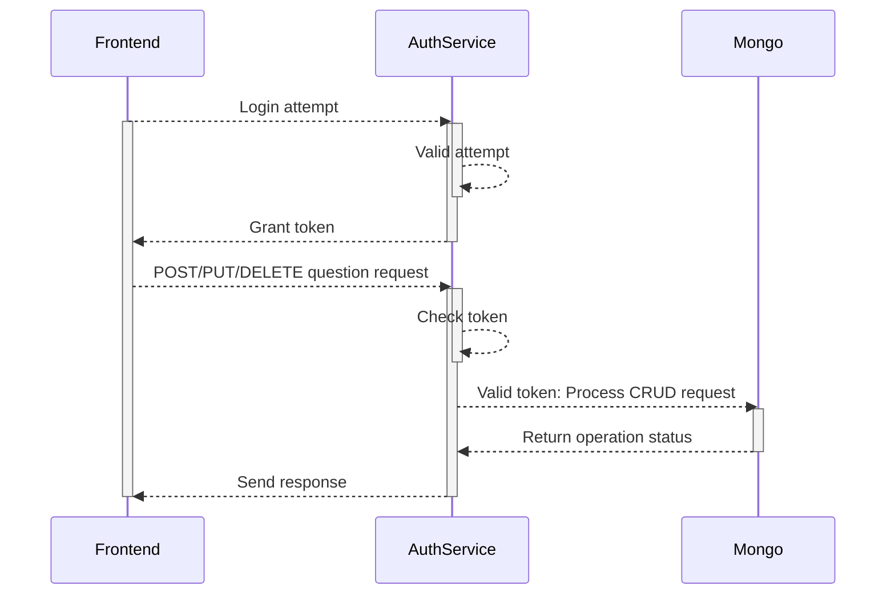

<h1 align="center"> Angielszczyzna </h1>    

<div align="center"> Aplikacja internetowa służąca do sprawdzania umiejętności użytkownika z języka angielskiego. </div>  
    
---  

## Identyfikacja zagadnienia biznesowego

**Cel projektu:**

- **Odbiorca:** osoby uczące się języka angielskiego, szukające szybkiej i interaktywnej formy sprawdzenia swoich umiejętności poprzez zestawy pytań otwartych i zamkniętych.
- **Potrzeba biznesowa:** zapewnienie narzędzia do regularnej samooceny postępów w nauce języka angielskiego pozwalającej na analizę wyników.

**Zakres projektu:**

- System umożliwia generowanie quizów z pytaniami otwartymi i zamkniętymi, sprawdzenie wyników oraz panel administracyjny do zarządzania pytaniami (dodawanie, edytowanie i usuwanie pytań). Aplikacja stanowi pełne rozwiązanie do samooceny swoich umiejętności bez konieczności integracji zewnętrznych systemów.

---   

## Wymagania systemowe i funkcjonalne

| Wymagania systemowe |  |  
|----------------|--|   
| Docker v1.27+  | do uruchomienia wszystkich serwisów |  

### Uruchomienie projektu

```yaml
docker-compose -f docker-compose.yaml up --build
```

### Wymagania funkcjonalne:

- Generowanie testu z określoną liczbą pytań (otwartych/zamkniętych) na podstawie puli pytań
- Ocena odpowiedzi: porównanie odpowiedzi z prawidłowymi wynikami
- Panel administracyjny do dodawania/edytowania/usuwania pytań (CRUD)
- Uwierzytelnianie po stronie backendu, kontekst sesji po stronie frontendu

### Architektura:

- **Warstwa prezentacji:** React/JS + Chakra-UI + HTML/CSS
- **Warstwa logiki biznesowej:** Express.js + TypeScript
- **Warstwa danych:** MongoDB

---   

## Analiza, zagadnienia i jego modelowanie

### Modele danych (MongoDB)

-   **Kolekcja** `open_questions`**:**  `{ _id, question, correctAnswer }`
-   **Kolekcja** `closed_questions`**:**  `{ _id, question, answers: [], correctAnswer }`

### Definicje typów (backend/src/types.ts)

```ts  
export type QuestionType = 'open' | 'closed';  
export interface OpenQuestion { question: string; correctAnswer: string; }
export interface ClosedQuestion { question: string; answers: string[]; correctAnswer: string; }
export interface UserAnswer { type: QuestionType; _id: ObjectId; answer: string; }
export interface AnswerResult { type: QuestionType; _id: ObjectId; answer: string; correctAnswer: string | null; }  
```  

### Diagram klas



### Przepływ danych (Funkcjonalny)

- Rozwiązywanie quizu



- Panel administracyjny



### Metody interakcji obiektów

1. Użytkownik prosi o nowy test → generowana odpowiedź z losowymi pytaniami.
2. Użytkownik przesyła odpowiedzi → backend zwraca poprawne odpowiedzi, frontend oblicza wynik.
3. Administrator loguje się → system zwraca token.

---  

## Implementacja

### Wykorzystane narzędzia i biblioteki dodatkowe

- mongodb
- nodejs
- express
- cors
- react
- react-router-dom
- chakra-ui
- axios

### Konfiguracja Dockera

Cała aplikacja uruchamiana jest za pomocą kontenerów, co zapewnia spójne działanie w różnych środowiskach. Daje to wiele korzyści, takich jak izolacja aplikacji, łatwość zarządzania, szybkość wdrażania oraz przenośność. Aplikacja podzielona jest na serwisy, które ze sobą współpracują.

```yaml # docker-compose.yaml  
version: '3.8'

services:
  frontend:
    build:
      context: ./frontend
      dockerfile: Dockerfile
    container_name: react-frontend
    ports:
      - "3000:80"
    depends_on:
      - backend

  backend:
    build:
      context: ./backend
      dockerfile: Dockerfile
    container_name: ts-backend
    ports:
      - "4200:4200"
    environment:
      - MONGO_URI=mongodb://mongo:27017
      - DB_NAME=language_course
      - DEV_ENVIRONMENT=true
    depends_on:
      - mongo

  mongo:
    image: mongo:7
    container_name: mongo
    ports:
      - "27017:27017"

```

### Kluczowe fragmenty kodu

#### Dostęp do bazy danych i konektory

Plik `db_connector.ts` inicjalizuje połączenie z MongoDB przez `MongoClient`

```ts  
export class MongoConnector {    
    private static instance: MongoConnector;    
    private client: MongoClient;    
    private db: Db | null = null;    
    private connected: boolean = false;    
    
    private constructor(    
        private readonly uri: string,    
        private readonly dbName: string    
    ) {    
          this.client = new MongoClient(this.uri);    
      }    
    
    static getInstance(): MongoConnector {    
        //...  
        return MongoConnector.instance;
    }    
    
    async init() {   
        //...   
    }    
    
    getDb(): Db {    
        //...
        return this.db;
    }    
    
    async close() {   
        //...   
    } 
}  
```  

```ts  
type OpenQuestionWithType = OpenQuestionResponse & { type: 'open' };  
  
export class OpenQuestionsDbConnector {    
    private readonly collection: Collection<OpenQuestion>;    
        
    public constructor(db: Db) {    
        this.collection = db.collection(COLLECTION_NAME);    
    }    
    
    async getRandomOpenQuestions(questions_number: number=10): Promise<OpenQuestionWithType[]> {
        //...  
        return typedResult as OpenQuestionWithType[];
    }    
      
    async getOpenQuestionsIds(): Promise<ObjectId[]> {    
        //...    
        return documents.map(q => q._id);  
    }    
   
    async getOpenQuestion(question_id: ObjectId): Promise<OpenQuestionWithType> {    
        //...  
        return typedResult as OpenQuestionWithType;
    }    
      
    async insertOpenQuestions(questions: OpenQuestion[]) {    
        //...  
        await this.collection.insertMany(questions)    
    }    
      
    async editOpenQuestion(question_id: ObjectId, question: OpenQuestion): Promise<void> {    
        //...   
        await this.collection.replaceOne({_id: question_id}, question)    
    }    
      
    async deleteOpenQuestion(question_id: ObjectId): Promise<void> {    
        //...  
        await this.collection.deleteOne({_id: question_id});   
    }
}  
```  

```ts  
type ClosedQuestionWithType = ClosedQuestionResponse & { type: 'closed' };    

export class ClosedQuestionsDbConnector {    
    private readonly collection: Collection<ClosedQuestion>;    
        
    public constructor(db: Db) {    
        this.collection = db.collection(COLLECTION_NAME);    
    }    
    
    async getRandomClosedQuestions(questions_number: number=10): Promise<ClosedQuestionWithType[]> {    
        //...  
        return typedResult as ClosedQuestionWithType[];
    }    
    
    async getClosedQuestion(question_id: ObjectId): Promise<ClosedQuestionWithType> {    
        //...  
        return typedResult as ClosedQuestionWithType;
    }    
    
    async insertClosedQuestions(questions: ClosedQuestion[]) {    
        //...  
        await this.collection.insertMany(questions)    
    }    
    
    async getClosedQuestionsIds(): Promise<ObjectId[]> {    
        //...  
        return documents.map(q => q._id);    
    }    
    
    async editClosedQuestion( id: ObjectId, question: ClosedQuestion): Promise<void> {    
        //...  
        await this.collection.replaceOne({_id: id}, question)   
    }    
    
    async deleteClosedQuestion(question_id: ObjectId): Promise<void> {    
        //...  
        await this.collection.deleteOne({_id: question_id});  
    } 
}  
```  

#### Pobieranie pytań zamkniętych i otwartych, sprawdzanie odpowiedzi

Endpointy wykorzystują QuestionService, dzięki czemu routing jest oddzielony od implementacji zachowania - taki model ułatwia też wprowadzanie ewentualnych zmian

```ts  
// backend/src/handlers/questions_handler.ts  

router.get('/closed-questions', async (_, res) => {
  try {
    const questions = await questionService.getRandomClosedQuestions();
    res.json(questions);
  } catch (error) {
    res.status(500).json({ error: 'Failed to fetch closed questions.' });
  }
});

router.get('/open-questions', async (_, res) => {
  try {
    const questions = await questionService.getRandomOpenQuestions();
    res.json(questions);
  } catch (error) {
    res.status(500).json({ error: 'Failed to fetch open questions.' });
  }
});

router.get('/questions-mix', async (_, res) => {
  try {
    const questions = await questionService.getMixedQuestions();
    res.json(questions);
  } catch (error) {
    res.status(500).json({ error: 'Failed to fetch mixed questions.' });
  }
});

router.get("/question/open/:id", async (req, res) => {
  try {
    const result = await questionService.getOpenQuestion(new ObjectId(req.params.id));
    res.status(200).json(result);
  } catch (error) {
    res.status(500).json({ error: 'Failed to get open question.' });
  }
})

router.get("/question/closed/:id", async (req, res) => {
  try {
    const result = await questionService.getClosedQuestion(new ObjectId(req.params.id));
    res.status(200).json(result);
  } catch (error) {
    res.status(500).json({ error: 'Failed to get open question.' });
  }
})

router.post('/check-answers', async (req, res) => {
  try {
    const answers: UserAnswer[] = req.body.answers;
    const results = await questionService.checkAnswers(answers);
    res.json(results);
  } catch (error) {
    res.status(500).json({ error: 'Failed to check answers.' });
  }
}); 
  
```  

```ts  
// backend/src/services/questions_service.ts  
  
export class QuestionsService {
    async getRandomClosedQuestions(question_number: number = 10): Promise<ClosedQuestion[]> {
        return await this.dbClosedConnector.getRandomClosedQuestions(question_number);
    }

    async getRandomOpenQuestions(question_number: number = 10): Promise<OpenQuestion[]> {
        return await this.dbOpenConnector.getRandomOpenQuestions(question_number);
    }

    async getOpenQuestion(id: ObjectId): Promise<OpenQuestion> {
        return await this.dbOpenConnector.getOpenQuestion(id)
    }

    async getClosedQuestion(id: ObjectId): Promise<ClosedQuestion> {
        return await this.dbClosedConnector.getClosedQuestion(id);
    }

    async getMixedQuestions(question_number: number = 10): Promise<(OpenQuestion | ClosedQuestion)[]> {
        const open_question_number = question_number - Math.floor(question_number / 2)
        const closed_question_number = question_number - open_question_number

        const open_questions = await this.dbOpenConnector.getRandomOpenQuestions(open_question_number);
        const closed_questions = await this.dbClosedConnector.getRandomClosedQuestions(closed_question_number);

        return [...open_questions, ...closed_questions];
    }

    async checkAnswers(answers: UserAnswer[]): Promise<AnswerResult[]> {
        return await Promise.all(
            answers.map(async ({type, _id, answer}) => {
                if (type === 'open') {
                    const found = await this.dbOpenConnector.getOpenQuestion(new ObjectId(_id));
                    return { type, _id, answer, correctAnswer: found?.correctAnswer ?? null };
                }
                const found = await this.dbClosedConnector.getClosedQuestion(new ObjectId(_id));
                return { type, _id, answer, correctAnswer: found?.correctAnswer ?? null };
            })
        );
    }
}
```  

#### Zarządzanie pytaniami

Endpointy przeznaczone dla panelu administracyjnego

```ts  
// backend/src/handlers/questions_handler.ts  

router.post("/question/open", async (req, res) => {
  if (req.headers.token === SAMPLE_TOKEN) {
    try {
      const question: OpenQuestion = req.body
      await questionService.addOpenQuestion(question);
      res.status(200).json("Question added successfully.");
    } catch (error) {
      res.status(500).json({ error: 'Failed to add question.' });
    }
  } else {
    res.status(401).json("User not allowed");
  }
})

router.post("/question/closed", async (req, res) => {
  if (req.headers.token === SAMPLE_TOKEN) {
    try {
      const question: ClosedQuestion = req.body
      await questionService.addClosedQuestion(question);
      res.status(200).json("Question added successfully.");
    } catch (error) {
      res.status(500).json({ error: 'Failed to add question.' });
    }
  } else {
    res.status(401).json("User not allowed");
  }
})

router.put("/question/closed", async (req, res) => {
  if (req.headers.token === SAMPLE_TOKEN) {
    try {
      const question: ClosedQuestionResponse = req.body
      await questionService.editClosedQuestion(question);
      res.status(200).json("Question put successfully.");
    } catch (error) {
      res.status(500).json({ error: 'Failed to update close question.' });
    }
  } else {
    res.status(401).json("User not allowed");
  }
})

router.put("/question/open", async (req, res) => {
  if (req.headers.token === SAMPLE_TOKEN) {
    try {
      const question: OpenQuestionResponse = req.body
      await questionService.editOpenQuestion(question);
      res.status(200).json("Question put successfully.");
    } catch (error) {
      res.status(500).json({ error: 'Failed to update open question.' });
    }
  } else {
    res.status(401).json("User not allowed");
  }
})

router.delete("/question/closed/:id", async (req, res) => {
  if (req.headers.token === SAMPLE_TOKEN) {
    try {
      await questionService.deleteClosedQuestion(new ObjectId(req.params.id))
      res.status(200).json("Question deleted successfully.");
    } catch (error) {
      res.status(500).json({ error: 'Failed to delete closed question.' });
    }
  } else {
    res.status(401).json("User not allowed");
  }
})

router.delete("/question/open/:id", async (req, res) => {
  if (req.headers.token === SAMPLE_TOKEN) {
    try {
      await questionService.deleteOpenQuestion(new ObjectId(req.params.id))
      res.status(200).json("Question deleted successfully.");
    } catch (error) {
      res.status(500).json({ error: 'Failed to delete closed question.' });
    }
  } else {
    res.status(401).json("User not allowed");
  }
})
```  

```ts  
// backend/src/services/questions_service.ts 

export class QuestionsService {
  async addOpenQuestion(question: OpenQuestion): Promise<void> {
    await this.dbOpenConnector.insertOpenQuestions([question])
  }

  async addClosedQuestion(question: ClosedQuestion): Promise<void> {
    await this.dbClosedConnector.insertClosedQuestions([question])
  }

  async editOpenQuestion(question: OpenQuestionResponse): Promise<void> {
    const question_without_id = {
      question: question.question,
      correctAnswer: question.correctAnswer,
    } as OpenQuestion

    await this.dbOpenConnector.editOpenQuestion(new ObjectId(question._id), question_without_id)
  }

  async editClosedQuestion(question: ClosedQuestionResponse): Promise<void> {
    const question_without_id = {
      question: question.question,
      answers: question.answers,
      correctAnswer: question.correctAnswer,
    } as ClosedQuestion;

    await this.dbClosedConnector.editClosedQuestion(new ObjectId(question._id), question_without_id)
  }

  async deleteClosedQuestion(question_id: ObjectId): Promise<void> {
    await this.dbClosedConnector.deleteClosedQuestion(question_id)
  }

  async deleteOpenQuestion(question_id: ObjectId): Promise<void> {
    await this.dbOpenConnector.deleteOpenQuestion(question_id)
  }
}  
```  

#### Frontend

Frontend został napisany przy użyciu React oraz Chakra-UI, dzięki czemu widok jest renderowany po stronie klienta, a do tego ładnie wygląda. Z wykorzystaniem wbudowanego i własnego trasowania (routes), zabezpieczamy aplikację przed próbą wejścia na nieistniejące lub niedostępne dla niezalogowanego użytkownika strony. Do głównych widoków można zaliczyć:

- główną aplikację

```js
// frontend/src/index.js

import React from "react";
import ReactDOM from "react-dom/client";
import "./index.css";
import App from "./App";
import reportWebVitals from "./reportWebVitals";
import { Toaster } from "./components/ui/toaster";
import { Provider } from "./components/ui/provider";
import { AuthProvider } from "./context/AuthContext";

const root = ReactDOM.createRoot(document.getElementById("root"));
root.render(
        <React.StrictMode>
          <AuthProvider>
            <Provider>
              <Toaster />
              <App />
            </Provider>
          </AuthProvider>
        </React.StrictMode>
);

reportWebVitals();
```

```js
// frontend/src/App.js

import { BrowserRouter as Router, Routes, Route } from "react-router-dom";

import Header from "./components/Header";
import Footer from "./components/Footer";
import Home from "./pages/Home";
import Login from "./pages/Login";
import Admin from "./pages/admin/Admin";
import NotFound from "./pages/NotFound";
import QuestionsPage from "./pages/QuestionsPage";
import ProtectedAdminRoute from "./components/ProtectedAdminRoute";

import { Navigate } from "react-router-dom";
import AdminOpenQuestions from "./pages/admin/AdminOpenQuestions";
import EditOpenQuestion from "./pages/admin/EditOpenQuestion";
import AddOpenQuestion from "./pages/admin/AddOpenQuestion";
import AdminClosedQuestions from "./pages/admin/AdminClosedQuestions";
import EditClosedQuestion from "./pages/admin/EditClosedQuestion";
import AddClosedQuestion from "./pages/admin/AddClosedQuestion";
import AddQuestion from "./pages/admin/AddQuestion";

function App() {
  return (
          <Router>
            <div
                    style={{
                      display: "flex",
                      flexDirection: "column",
                      minHeight: "100vh",
                    }}
            >
              <Header />
              <div style={{ flex: 1 }}>
                <Routes>
                  <Route path="/" element={<Home />} />
                  <Route path="/login" element={<Login />} />
                  <Route
                          path="/admin"
                          element={
                            <ProtectedAdminRoute>
                              <Admin />
                            </ProtectedAdminRoute>
                          }
                  />

                  <Route
                          path="/admin/open"
                          element={
                            <ProtectedAdminRoute>
                              <AdminOpenQuestions />
                            </ProtectedAdminRoute>
                          }
                  />
                  <Route
                          path="/admin/open/edit/:id"
                          element={
                            <ProtectedAdminRoute>
                              <EditOpenQuestion />
                            </ProtectedAdminRoute>
                          }
                  />
                  <Route
                          path="/admin/open/add"
                          element={
                            <ProtectedAdminRoute>
                              <AddOpenQuestion />
                            </ProtectedAdminRoute>
                          }
                  />
                  <Route
                          path="/admin/add"
                          element={
                            <ProtectedAdminRoute>
                              <AddQuestion />
                            </ProtectedAdminRoute>
                          }
                  />
                  <Route
                          path="/admin/closed"
                          element={
                            <ProtectedAdminRoute>
                              <AdminClosedQuestions />
                            </ProtectedAdminRoute>
                          }
                  />
                  <Route
                          path="/admin/closed/edit/:id"
                          element={
                            <ProtectedAdminRoute>
                              <EditClosedQuestion />
                            </ProtectedAdminRoute>
                          }
                  />
                  <Route
                          path="/admin/closed/add"
                          element={
                            <ProtectedAdminRoute>
                              <AddClosedQuestion />
                            </ProtectedAdminRoute>
                          }
                  />
                  <Route path="/:type" element={<QuestionsPage />} />
                  <Route path="/404" element={<NotFound />} />
                  <Route path="*" element={<Navigate to="/404" />} />
                </Routes>
              </div>
              <Footer />
            </div>
          </Router>
  );
}

export default App;

```

- stronę główną

```js
// frontend/src/pages/Home.js

import NavigationPanel from "../components/NavigationPanel";

const Home = () => {
  return (
    <NavigationPanel
      heading="Wybierz tryb testu"
      description="Z nami angielski jest prostszy! Sprawdź swoje umiejętności i poprawiaj je każdego dnia."
      actions={[
        { label: "Pytania zamknięte", path: "/closed-questions" },
        { label: "Pytania otwarte", path: "/open-questions" },
        { label: "Mix", path: "/questions-mix" },
      ]}
    />
  );
};

export default Home;
```

- stronę z pytaniami

```js
// frontend/src/pages/QuestionsPage.js

import { useEffect, useState } from "react";
import { useParams, useNavigate, Navigate } from "react-router-dom";
import { IoReturnDownBack, IoRefresh } from "react-icons/io5";

import axios from "axios";
import { Box, Button, Text, Stack, Heading, Spinner, Alert, Flex, RadioGroup, IconButton, Textarea } from "@chakra-ui/react";

const QuestionsPage = () => {
  const { type } = useParams();
  const [questions, setQuestions] = useState([]);
  const [answers, setAnswers] = useState({});
  const [results, setResults] = useState(null);
  const [score, setScore] = useState(null);
  const [loading, setLoading] = useState(true);
  const [error, setError] = useState(null);
  const allowedTypes = ["closed-questions", "open-questions", "questions-mix"];
  const isValidType = allowedTypes.includes(type);
  const navigate = useNavigate();

  const endpointMap = {
    // ...
  };

  const fetchQuestions = () => {
    // ...
    axios.get(endpointMap[type]).then((res) => {
        if (Array.isArray(res.data)) {
          // ...
          setQuestions(preparedQuestions);
          // ...
        } else {
          setQuestions([]);
          setError("Nieprawidłowy format danych z serwera.");
        }
      })
      // ...
  };

  useEffect(() => {
    if (isValidType) fetchQuestions();
  }, [type]);

  if (!isValidType) {
    return <Navigate to="/404" replace />;
  }

  const handleInputChange = (localId, value) => {
    setAnswers((prev) => ({ ...prev, [localId]: value }));
  };

  const handleSubmit = () => {
    const formattedAnswers = questions.map((q) => ({
      type: q.type,
      _id: q._id,
      answer: answers[q._localId] || "",
    }));

    axios.post("api/check-answers", { answers: formattedAnswers })
      .then((res) => {
        if (Array.isArray(res.data)) {
          // ...
          setResults(resultMap);
          const calculatedScore = Object.values(resultMap).filter((r) => r.isCorrect).length;
          setScore(calculatedScore);
        } else {
          setError("Nieprawidłowa odpowiedź z serwera.");
        }
      });
  };

  const renderBackButton = () => (
    <IconButton onClick={() => navigate("/")} variant={"ghost"} size="md" aria-label="Powrót">
      <IoReturnDownBack />
    </IconButton>
  );

  if (loading) {
    return (
      <Flex minH="100vh" justify="center" align="center" direction="column">
        <Spinner size="xl" mb={4} />
        <Text>Ładowanie pytań...</Text>
      </Flex>
    );
  }

  if (error) {
    return (
      <Flex minH="70vh" justify="center" align="center" px={4} textAlign="center">
        <Alert.Root status="error" maxW={"500px"}>
          <Alert.Indicator />
          <Alert.Content>
            <Alert.Title>Błąd podczas ładowania pytań</Alert.Title>
            <Alert.Description>
              <Text>{error}</Text>
              <Flex align="center" justify="center">
                <Text>Powrót</Text>
                {renderBackButton()}
              </Flex>
            </Alert.Description>
          </Alert.Content>
        </Alert.Root>
      </Flex>
    );
  }

  return (
    <Box maxW={{ base: "100%", md: "700px" }} mx="auto" px={{ base: 4, sm: 6, md: 12 }} py={6}>
      // ...
    </Box>
  );
};

export default QuestionsPage;
```

- stronę logowania oraz panel administratora

```js
// frontend/src/components/LoginComponent.js

import { useState } from "react";
import axios from "axios";
import { toaster } from "./ui/toaster";
import { AuthForm, AuthInput } from "./AuthForm";
import { useContext } from "react";
import { AuthContext } from "../context/AuthContext";
import { useNavigate } from "react-router-dom";

const LoginComponent = () => {
  const [username, setUsername] = useState("");
  const [password, setPassword] = useState("");
  const [error, setError] = useState("");
  const { login } = useContext(AuthContext);
  const navigate = useNavigate();

  const handleLogin = async (e) => {
    e.preventDefault();
    setError("");

    try {
      const response = await axios.get("/api/authentication", {
        headers: {
          username,
          password,
        },
        validateStatus: (status) => status < 500,
      });
      console.log(response);

      if (response?.status === 200 && response.data?.token) {
        login(username, response.data.token);
        toaster.success({
          title: "Zalogowano",
          description: `Witaj, ${username}`,
        });

        if (username === "admin") {
          navigate("/admin");
        } else {
          navigate("/login");
        }
      } else {
        const errorMessage =
                response.data?.error || "Nieprawidłowe dane logowania";
        setError(errorMessage);
        toaster.error({
          title: "Nie udało się zalogować",
          description: errorMessage,
        });
      }
    } catch (error) {
      const errorMessage =
              error.response?.data?.error ||
              error.message ||
              "Nie udało się zalogować. Spróbuj ponownie później.";
      setError(errorMessage);
      toaster.error({
        title: "Error",
        description: errorMessage,
      });
    }
  };

  return (
          <AuthForm
                  title="Logowanie"
                  onSubmit={handleLogin}
                  error={error}
                  buttonText="Zaloguj"
          >
            <AuthInput
                    label="Nazwa użytkownika"
                    type="text"
                    value={username}
                    onChange={(e) => setUsername(e.target.value)}
                    required
            />
            <AuthInput
                    label="Hasło"
                    type="password"
                    value={password}
                    onChange={(e) => setPassword(e.target.value)}
                    required
            />
          </AuthForm>
  );
};

export default LoginComponent;
```

```js
// frontend/src/pages/admin/AdminClosedQuestions.js

import { Box, Heading, Text, Stack, Button, Spinner, IconButton, Flex } from "@chakra-ui/react";
import { IoReturnDownBack } from "react-icons/io5";
import { useEffect, useState, useContext } from "react";
import axios from "axios";
import { AuthContext } from "../../context/AuthContext";
import { useNavigate } from "react-router-dom";
import { toaster } from "../../components/ui/toaster";

const AdminClosedQuestions = () => {
  const [questions, setQuestions] = useState([]);
  const [loading, setLoading] = useState(true);
  const { token } = useContext(AuthContext);
  const navigate = useNavigate();

  const fetchQuestions = async () => {
    try {
      const idsResponse = await axios.get("/api/questions-id/closed");
      const ids = idsResponse.data;

      const questionPromises = ids.map((id) =>
              axios.get(`/api/question/closed/${id}`)
      );

      const questionResults = await Promise.all(questionPromises);
      const fullQuestions = questionResults.map((res) => res.data);

      setQuestions(fullQuestions);
    } catch (err) {
      toaster.error({
        title: "Błąd",
        description: "Nie udało się pobrać pytań zamkniętych.",
      });
    } finally {
      setLoading(false);
    }
  };

  const handleDelete = async (id) => {
    try {
      await axios.delete(`/api/question/closed/${id}`, {
        headers: { token },
      });

      toaster.success({
        title: "Usunięto",
        description: "Pytanie zostało usunięte.",
      });

      setQuestions((prev) => prev.filter((q) => q._id !== id));
    } catch (err) {
      toaster.error({
        title: "Błąd",
        description: "Nie udało się usunąć pytania.",
      });
    }
  };

  useEffect(() => {
    fetchQuestions();
  }, []);

  if (loading) {
    return (
            <Flex justify="center" align="center" minH="70vh">
              <Spinner size="xl" />
            </Flex>
    );
  }

  return (
          <Box maxW="800px" mx="auto" py={6} px={4}>
            <Flex mb={6} justify="space-between" align="center">
              <Heading size="lg">Zarządzaj pytaniami zamkniętymi</Heading>
              <IconButton
                      onClick={() => navigate("/admin")}
                      variant={"ghost"}
                      size="md"
                      aria-label="Powrót"
              >
                <IoReturnDownBack />
              </IconButton>
            </Flex>
            <Button
                    colorScheme="blue"
                    mb={6}
                    onClick={() => navigate("/admin/closed/add")}
            >
              + Dodaj nowe pytanie
            </Button>

            <Stack spacing={6}>
              {questions.map((question, idx) => (
                      <Box
                              key={question._id}
                              p={4}
                              boxShadow="md"
                              borderRadius="md"
                              bg="white"
                      >
                        <Text fontWeight="bold" mb={2}>
                          {idx + 1}. {question.question}
                        </Text>

                        <Stack spacing={1} mb={2}>
                          {question.answers.map((ans, i) => (
                                  <Text
                                          key={i}
                                          color={
                                            ans === question.correctAnswer ? "green.600" : "gray.700"
                                          }
                                  >
                                    • {ans}
                                  </Text>
                          ))}
                        </Stack>

                        <Stack direction="row" spacing={4} mt={2}>
                          <Button
                                  colorScheme="teal"
                                  onClick={() => navigate(`/admin/closed/edit/${question._id}`)}
                          >
                            Edytuj
                          </Button>
                          <Button
                                  colorScheme="red"
                                  onClick={() => handleDelete(question._id)}
                          >
                            Usuń
                          </Button>
                        </Stack>
                      </Box>
              ))}
            </Stack>
          </Box>
  );
};

export default AdminClosedQuestions;

```

(a także inne widoki, które składają się na panel administratora, jak na przykład z edycją pytania - dla czytelności postanowiono nie dołączać ich do Readme)

**Uwagi dotyczące implementacji:**

- Wszystkie dane testowe znajdują się w pliku `mockData.ts`, wykorzystywanym przy inicjalizacji bazy.
- Ze względów konsystencji, nie zdecydowaliśmy się na zaimplementowanie mechanizmu trwałej historii – każda sesja operuje na danych mockowanych.

---   

## Podsumowanie

Aplikacja realizuje założony cel: generuje quizy językowe, pozwala na weryfikację wiedzy poprzez zwracanie poprawnych odpowiedzi oraz oferuje panel do zarządzania pytaniami. Nie napotkano większych trudności - głównie były to kwestie organizacyjne, na przykład decyzja o strukturze przesyłanych danych pomiędzy frontem, a backendem. W przyszłości planowane są: zapisywanie historii wyników, moduł analizy postępów (dashboard), generowanie raportów PDF oraz wsparcie mediów (audio/video) w pytaniach.
    
---
